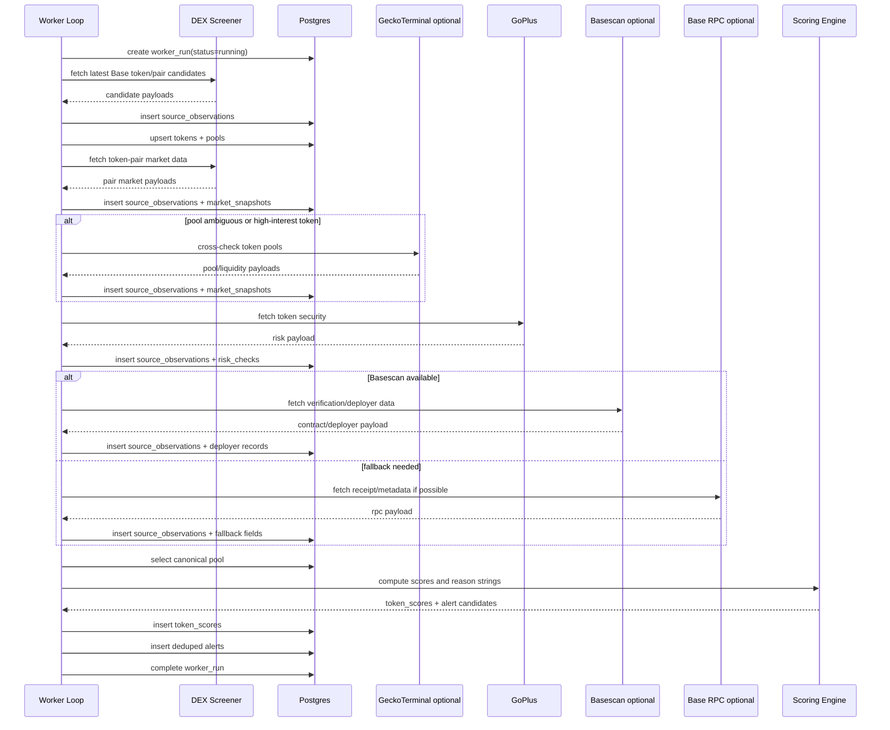

# 4c — Ingestion and Enrichment Pipeline

## Purpose

This document defines the MVP ingestion and enrichment pipeline for the Base Launch Intelligence Console.

The pipeline turns fragmented provider data into one normalized, scoreable token record:

```text
candidate launch/pair
→ raw provider observation
→ token/pool normalization
→ market enrichment
→ risk enrichment
→ deployer enrichment
→ canonical pool selection
→ score + triage label
→ alert evaluation
→ ranked feed row
```

The goal is to validate a useful internal ranked feed, not to build a comprehensive Base indexer.

---

## Pipeline Scope

## In scope for v0

| Capability            | v0 Decision                                                          |
| --------------------- | -------------------------------------------------------------------- |
| Discovery             | DEX Screener first                                                   |
| Market enrichment     | DEX Screener primary                                                 |
| Pool cross-check      | GeckoTerminal optional                                               |
| Contract risk         | GoPlus primary                                                       |
| Deployer/verification | Basescan if available; otherwise GoPlus creator field / RPC fallback |
| Onchain reads         | Base RPC targeted reads only                                         |
| Scoring               | Rule-based, explainable                                              |
| Alerts                | High-score and obvious high-risk only                                |
| Cadence               | 3-minute worker loop                                                 |

## Out of scope for v0

```text
Farcaster/Neynar ingestion
X/Twitter ingestion
Telegram ingestion
full-chain indexing
self-hosted Base node
wallet graphing
swap-event warehouse
route simulation
execution or trading
ML ranking
Kafka/ClickHouse/Redis queue infrastructure
```

---

## Pipeline Design Principles

## 1. Raw first, normalized second

Every provider response should be written to `source_observations` before normalized tables are updated.

This allows debugging when a normalized field looks wrong.

## 2. Continue on partial failure

A single provider failure should not stop the run.

Examples:

- GeckoTerminal fails → continue with DEX Screener data and lower canonical-pool confidence if needed.
- Basescan fails → continue with GoPlus creator field or unknown deployer.
- GoPlus fails → do not mark token safe; mark risk unknown and lower confidence.

## 3. Use explicit staleness and confidence

The pipeline should track provider fetch time and score confidence.

Stale or missing fields should affect confidence and reason strings.

## 4. Keep provider adapters thin

Provider modules should fetch and lightly validate payloads.

Normalization should happen in separate modules so provider-specific quirks do not leak into the scoring engine.

## 5. Do not let market data overpower risk

Critical contract risk should be able to override strong liquidity or volume.

The product is a research triage tool, not a volume leaderboard.

---

## High-Level Sequence



---

# Worker Runtime Model

## Main loop

The worker is a long-running Node/TypeScript process.

Default cadence:

```text
Every 3 minutes
```

Configured by:

```text
WORKER_POLL_INTERVAL_MS=180000
```

## Main loop pseudocode

```ts
async function runWorkerLoop() {
  while (true) {
    if (runInProgress) {
      logger.warn('Skipping run because previous run is still active');
      await sleep(WORKER_POLL_INTERVAL_MS);
      continue;
    }

    runInProgress = true;

    try {
      await runPipelineOnce();
    } catch (error) {
      logger.error({ error }, 'Pipeline run failed');
    } finally {
      runInProgress = false;
      await sleep(WORKER_POLL_INTERVAL_MS);
    }
  }
}
```

## Single-run pseudocode

```ts
async function runPipelineOnce() {
  const run = await createWorkerRun();

  try {
    const candidates = await discoverCandidates(run.id);

    const normalizedCandidates = await normalizeCandidates(candidates, run.id);

    await enrichMarket(normalizedCandidates, run.id);
    await enrichRisk(normalizedCandidates, run.id);
    await enrichDeployer(normalizedCandidates, run.id);

    await selectCanonicalPools(normalizedCandidates, run.id);

    const scores = await scoreTokens(normalizedCandidates, run.id);

    await evaluateAlerts(scores, run.id);

    await completeWorkerRun(run.id, 'success');
  } catch (error) {
    await completeWorkerRun(run.id, 'failure', error);
    throw error;
  }
}
```

The actual implementation should mark a run as `partial_failure` when one or more providers fail but the pipeline still completes enough work to update the feed.

---

# Stage 0 — Worker Run Initialization

## Input

None.

## Output

A `worker_runs` row with:

```text
status = running
started_at = now()
```

## Rules

- Do not allow overlapping worker runs.
- Log run start.
- Initialize counters to zero.
- Track provider-level errors separately from fatal run errors.

---

# Stage 1 — Candidate Discovery

## Goal

Find candidate Base token launches or token/pool records worth enriching.

## Primary source

DEX Screener.

## Current v0 discovery pattern

Use DEX Screener as the first candidate source because it is the fastest path to usable token/pool metadata without building a Base event indexer.

Expected discovery flow:

```text
fetch latest token/profile or recent pair data
filter to Base records
for each candidate token address, fetch pair data if needed
normalize token + pool candidates
```

If using DEX Screener latest token profiles as the candidate surface, the follow-up enrichment step should fetch token-pair data for each Base token address.

## Candidate shape

```ts
type CandidateLaunch = {
  chainId: 8453;
  tokenAddress: string;
  poolAddress: string | null;
  dexId: string | null;
  tokenName: string | null;
  tokenSymbol: string | null;
  quoteTokenAddress: string | null;
  quoteTokenSymbol: string | null;
  pairCreatedAt: Date | null;
  liquidityUsd: number | null;
  source: 'dexscreener' | 'rpc';
  fetchedAt: Date;
  rawPayloadId: string;
};
```

## Discovery rules

1. Keep only Base records.
2. Convert external chain IDs to internal `8453`.
3. Normalize all EVM addresses to lowercase.
4. Store the raw provider response in `source_observations`.
5. Upsert `tokens` by `chain_id + address`.
6. Upsert `pools` by `chain_id + pool_address` when available.
7. Use `first_seen_at` when provider launch/pair time is missing.
8. Do not trust token name or symbol as identity.

## Token-side detection

A DEX pair has two token sides. The product token should usually be the non-blue-chip token.

Suggested blue-chip quote assets for v0:

```text
WETH
USDC
USDbC
DAI
cbBTC
```

Heuristic:

```text
if one side is a known quote asset:
  product token = the other side
else:
  product token = provider baseToken, but mark metadata/canonical confidence lower
```

## Discovery failure behavior

| Failure                         | Behavior                                                                                                                                     |
| ------------------------------- | -------------------------------------------------------------------------------------------------------------------------------------------- |
| DEX Screener unavailable        | Store error in `source_observations`; complete run as `partial_failure` or `failure` depending on whether cached candidates can be processed |
| No candidates returned          | Complete run successfully with zero candidates                                                                                               |
| Candidate missing token address | Store raw observation; skip normalized token insert                                                                                          |
| Candidate missing pool address  | Insert token if address exists; market enrichment may resolve pool later                                                                     |

---

# Stage 2 — Token and Pool Normalization

## Goal

Map provider-specific records into canonical `tokens` and `pools` records.

## Inputs

- candidate payloads
- existing token records
- existing pool records

## Outputs

- upserted `tokens`
- upserted `pools`
- candidate processing list for downstream enrichment

## Token normalization

Map provider fields into:

```text
chain_id
address
name
symbol
decimals
first_seen_at
first_seen_source
deployer_address if present
creation_tx_hash if present
is_verified if present
metadata_confidence
```

## Pool normalization

Map provider fields into:

```text
chain_id
address
dex_id
base_token_id
base_token_address
quote_token_address
quote_token_symbol
pair_created_at
first_seen_at
source
canonical fields defaulted to low-confidence
```

## Upsert behavior

## Tokens

```text
insert if new
preserve earliest first_seen_at
update name/symbol/decimals only when new non-null values arrive
never overwrite known deployer fields with null
```

## Pools

```text
insert if new
preserve earliest first_seen_at
update pair_created_at if new value is earlier or previously null
update quote/dex fields when new non-null values arrive
canonical fields can be recomputed later
```

---

# Stage 3 — Market Enrichment

## Goal

Fetch enough market data to support the ranked feed and liquidity-quality scoring.

## Primary source

DEX Screener.

## Optional source

GeckoTerminal.

## Inputs

- normalized candidate tokens
- known pools
- token addresses
- pool addresses

## Outputs

- `market_snapshots`
- updated `pools` when additional pool metadata appears
- raw payloads in `source_observations`

## DEX Screener market fields

Expected normalized fields:

```text
price_usd
liquidity_usd
fdv_usd
market_cap_usd
volume_5m_usd
volume_1h_usd
volume_6h_usd
volume_24h_usd
txns_5m_buys
txns_5m_sells
txns_1h_buys
txns_1h_sells
pair_created_at
dex_id
quote_token
```

## GeckoTerminal cross-check trigger

Do not call GeckoTerminal for every token on the first implementation unless rate limits are clearly safe.

Call GeckoTerminal when:

```text
DEX Screener returns multiple pools for the same token
DEX Screener liquidity appears suspicious or missing
a token is close to High Priority
canonical pool confidence is low or medium
a manual debug flag requests cross-checking
```

## Market enrichment rules

1. Insert a new `market_snapshots` row for each provider observation.
2. Do not overwrite historical snapshots.
3. Treat market cap and FDV as context, not truth.
4. Do not compute high-confidence liquidity scores from low-confidence pool selection.
5. Do not let raw volume dominate ranking.
6. Mark stale market snapshots in the API if no recent snapshot exists.

## Market data staleness

Suggested v0 staleness thresholds:

| Token tier | Fresh if market data is newer than |
| ---------- | ---------------------------------: |
| Hot        |                          5 minutes |
| Warm       |                         15 minutes |
| Cold       |             60+ minutes or ignored |

These thresholds are for UI/scoring confidence, not strict job scheduling.

---

# Stage 4 — Contract-Risk Enrichment

## Goal

Fetch enough contract-risk data to flag obvious high-risk launches.

## Primary source

GoPlus.

## Optional later source

TokenSniffer, only if access is easy.

## Inputs

- token address
- chain ID `8453`

## Outputs

- `risk_checks`
- optional updates to `tokens.is_verified`
- raw payloads in `source_observations`

## GoPlus fields to normalize

```text
is_honeypot
buy_tax
sell_tax
is_tax_modifiable
has_blacklist
has_whitelist
can_mint
owner_address
ownership_renounced
is_proxy if available
is_verified / is_open_source if available
top_holder_pct if available
top10_holder_pct if available
lp_locked_or_burned if available
creator_address if available
risk_level
risk_summary
```

## Risk enrichment rules

1. Fetch risk data immediately for newly seen tokens.
2. Recheck recent tokens occasionally because scanner coverage and token state can change.
3. Store missing fields as `NULL`.
4. Never treat missing risk data as safe.
5. Critical risk flags should force or strongly bias the score toward `Risky`.
6. Risk output should produce reason-string inputs.

## Suggested risk recheck policy

| Token tier |           Risk recheck cadence |
| ---------- | -----------------------------: |
| New token  |                    immediately |
| Hot token  |            every 15-30 minutes |
| Warm token |                every 2-6 hours |
| Cold token | stop unless manually refreshed |

## Critical risk candidates

The scoring layer should treat these as hard downgrade signals:

```text
honeypot true
very high sell tax
blacklist true
whitelist restriction true
mint/admin critical risk
tax modifiable with non-trivial taxes
proxy/upgradeability risk with weak verification
```

Exact thresholds belong in `4d_scoring_and_triage_model.md`.

---

# Stage 5 — Deployer and Verification Enrichment

## Goal

Identify the deployer and create a basic deployer-history summary.

## Primary source

Basescan, if API access is available.

## Fallbacks

```text
GoPlus creator_address
Base RPC transaction receipt / creation transaction lookup
internal first-seen history
manual external link
```

## Inputs

- token address
- GoPlus creator fields if available
- Basescan contract metadata if available
- RPC receipt fields if available

## Outputs

- `tokens.deployer_id`
- `tokens.deployer_address`
- `tokens.creation_tx_hash`
- `tokens.is_verified`
- `tokens.is_proxy`
- `deployers`
- `deployer_history_snapshots`
- raw payloads in `source_observations`

## Basescan fields to normalize

```text
contract_creator
creation_tx_hash
source_code / verified status
proxy flag
implementation address if available
contract name if useful
```

## Deployer resolution priority

```text
1. Basescan contract creator
2. GoPlus creator_address
3. RPC-derived creator/receipt path if feasible
4. Unknown deployer
```

## Deployer history v0

The first version should compute a shallow deployer summary:

```text
internal_prior_seen_token_count
prior_contract_count if available
prior_token_count if available
verified_contract_count if available
suspicious_prior_launch_count if available, otherwise null
history_confidence
summary
```

## Deployer rules

1. Unknown deployer is not automatically bad.
2. Missing deployer lowers confidence.
3. Repeat deployer is not automatically bad; the score needs context.
4. Internal history is valid even when external prior-history APIs are unavailable.
5. External deployer history is best-effort only for v0.

## Example deployer summaries

```text
unknown deployer; no creator field available
new deployer in internal history; external history unavailable
repeat deployer seen 4 times internally
repeat deployer; prior contract count from Basescan unavailable
```

---

# Stage 6 — Canonical Pool Selection

## Goal

Choose the most plausible primary pool for scoring liquidity and displaying market data.

Wrong pool selection corrupts:

```text
price
liquidity
market cap / FDV interpretation
volume interpretation
overall score
```

## Inputs

- all known pools for token
- latest market snapshots per pool
- DEX Screener pool data
- optional GeckoTerminal pool data

## Outputs

Updated `pools` rows:

```text
is_canonical_candidate
canonical_confidence
canonical_reason
```

## v0 heuristic

Score each pool candidate using:

| Factor                                   | Why it matters                          |
| ---------------------------------------- | --------------------------------------- |
| Highest reliable liquidity               | Usually strongest primary-pool signal   |
| Quote asset quality                      | WETH/USDC stronger than obscure quotes  |
| Known DEX venue                          | Known venues are easier to interpret    |
| Pair age                                 | Useful for launch-stage context         |
| Reasonable volume/liquidity relationship | Helps avoid obvious wash/noise patterns |
| DEX Screener / GeckoTerminal agreement   | Improves confidence when available      |

## Suggested quote-asset quality tiers

| Tier         | Symbols                 |
| ------------ | ----------------------- |
| Strong       | `WETH`, `USDC`          |
| Medium       | `USDbC`, `DAI`, `cbBTC` |
| Weak/unknown | Everything else         |

## Canonical confidence rules

## High confidence

Use `high` when:

```text
one pool clearly dominates liquidity
quote asset is strong
venue is known
provider data is fresh
optional cross-check agrees, if used
```

## Medium confidence

Use `medium` when:

```text
pool appears likely canonical
but cross-check is missing
or liquidity difference is not decisive
or quote asset is acceptable but not ideal
```

## Low confidence

Use `low` when:

```text
multiple pools are close in liquidity
only weak quote pools exist
provider data is stale or contradictory
pool address is missing
market data is incomplete
```

## Canonical-pool rules

1. Exactly one pool per token should be marked canonical when possible.
2. If no pool can be trusted, mark all as `is_canonical_candidate = false` and let scoring use low confidence.
3. A low-confidence canonical pool should be visible in the reason string.
4. Canonical pool selection can change across runs.

---

# Stage 7 — Score Computation

## Goal

Compute an explainable token score and triage label from the latest normalized data.

## Inputs

```text
latest canonical pool
latest market snapshot for canonical pool
latest risk check
latest deployer-history snapshot
missing/stale field state
```

## Outputs

A `token_scores` row.

## v0 score fields

```ts
type TokenScore = {
  contractRiskScore: number;
  liquidityQualityScore: number;
  deployerHistoryScore: number;
  overallScore: number;
  triageLabel:
    | 'Ignore'
    | 'Risky'
    | 'Watch'
    | 'Research Deeper'
    | 'High Priority';
  confidence: 'low' | 'medium' | 'high';
  reasonSummary: string;
  reasonDetails: string[];
};
```

## v0 weights

```text
Contract risk: 40%
Liquidity quality: 40%
Deployer history: 20%
```

## Scoring rules

1. Every token should receive a score if it has at least token identity.
2. Missing data lowers confidence instead of crashing scoring.
3. Critical contract risk can force `Risky`.
4. Very low liquidity should block `High Priority`.
5. Unknown deployer should not automatically force `Risky`.
6. Every score must include a reason summary.
7. Reason strings should not overstate confidence.

## Example reason strings

```text
Risky: honeypot flag present and sell tax is high; liquidity is not enough to offset contract risk.
Watch: adequate liquidity, but deployer is unknown and contract-risk data is incomplete.
Research Deeper: clean basic risk check, adequate WETH liquidity, and deployer has limited but non-negative history.
Ignore: very low liquidity and weak market activity; no strong reason to inspect further.
```

Full scoring rules belong in `4d_scoring_and_triage_model.md`.

---

# Stage 8 — Alert Evaluation

## Goal

Create deterministic v0 alerts without alert spam.

## Inputs

- latest token score
- latest risk check
- existing alerts

## Outputs

- `alerts` rows
- worker console logs
- dashboard flags

## v0 alert types

```text
new_high_score_launch
obvious_high_risk_launch
```

## High-score alert rule

Suggested starting rule:

```text
overall_score >= 80
confidence != low
triage_label = High Priority
no critical contract-risk flag
not already alerted for this token/state
```

## High-risk alert rule

Suggested starting rule:

```text
honeypot risk true
OR high sell tax
OR blacklist true
OR mint/admin critical risk
OR unverified + very low liquidity + suspicious deployer signal
```

## Dedupe behavior

Use `alerts.dedupe_key`.

Suggested format:

```text
{alert_type}:{chain_id}:{token_address}:{state_bucket}
```

Examples:

```text
new_high_score_launch:8453:0xabc...:score_ge_80
obvious_high_risk_launch:8453:0xabc...:honeypot_true
```

If insert conflicts on `dedupe_key`, do not emit a duplicate alert.

---

# Refresh Cadence and Token Aging

## Main cadence

```text
Worker run every 3 minutes
```

## Source cadence

| Step                           |                              Cadence | Notes                 |
| ------------------------------ | -----------------------------------: | --------------------- |
| DEX Screener discovery         |                            every run | Main candidate source |
| DEX Screener market refresh    |             every run for hot tokens | Start simple          |
| GoPlus risk check              |            first seen, then periodic | Avoid provider spam   |
| Basescan deployer/verification | first seen, then periodic if missing | Optional API key      |
| GeckoTerminal cross-check      |      on demand or every 5-15 minutes | Optional              |
| Base RPC reads                 |                            on demand | Fallback only         |
| Canonical pool selection       |                 after market updates | Cheap                 |
| Scoring                        |       every run for processed tokens | Cheap                 |
| Alert evaluation               |                        after scoring | Deduped               |

## Token tiers

| Tier | Definition                     | Behavior                                        |
| ---- | ------------------------------ | ----------------------------------------------- |
| Hot  | first seen in last 60 minutes  | refresh market every run; prioritize enrichment |
| Warm | first seen in last 24 hours    | refresh less often after basic loop works       |
| Cold | older than 24 hours or ignored | reduce refresh or stop                          |

The first implementation can refresh all recent candidates every run. Token-tier scheduling can be added once the basic loop works.

---

# Provider Adapter Contracts

## Provider module responsibilities

Each provider adapter should:

```text
build request
execute request
return raw response
record response status/duration
throw typed provider errors
avoid normalizing into DB entities directly
```

Provider modules should not:

```text
write database rows directly
compute scores
choose canonical pools
hide provider errors
silently coerce missing values into safe values
```

## Normalizer module responsibilities

Normalizer modules should:

```text
parse provider payload
extract MVP fields
normalize addresses
convert timestamps
convert numeric strings
return typed normalized objects
record missing fields as null
```

Normalizer modules should not:

```text
call provider APIs
perform scoring
make safety claims
```

---

# Error Handling

## Error classes

Suggested provider/pipeline error categories:

```text
network_error
rate_limit_error
provider_error
parse_error
missing_required_field
normalization_error
database_error
scoring_error
```

## Provider error behavior

| Error                     | Behavior                                                                  |
| ------------------------- | ------------------------------------------------------------------------- |
| Network timeout           | Store source observation with error; retry with backoff if cheap          |
| HTTP 429 / rate limit     | Store error; back off provider; continue run                              |
| Parse error               | Store raw payload and parse error; skip normalized write for that payload |
| Missing token address     | Store raw payload; skip candidate                                         |
| Missing optional field    | Store normalized row with null field                                      |
| Basescan unavailable      | Use GoPlus/RPC fallback or unknown deployer                               |
| GeckoTerminal unavailable | Continue with DEX Screener only                                           |
| GoPlus unavailable        | Risk unknown; lower confidence                                            |

## Retry policy

Suggested simple retry policy:

```text
max attempts: 2
initial delay: 500ms
backoff: 2x
jitter: yes
```

Do not build a complex retry/queue system for v0.

---

# Rate Limit Policy

## Principles

1. Do not poll optional providers aggressively.
2. Cache static or slow-changing data.
3. Reuse existing snapshots when data is fresh enough.
4. Prefer token-tier scheduling over broad repeated fetching.
5. Add hard per-run caps to prevent runaway loops.

## Suggested per-run caps

| Step                       | Starting cap |
| -------------------------- | -----------: |
| Candidates processed       |       50-100 |
| GoPlus checks              |           50 |
| Basescan checks            |           25 |
| GeckoTerminal cross-checks |        10-20 |
| RPC fallback reads         |           25 |

These are starting values. Adjust after real smoke tests.

---

# Idempotency and Deduplication

## Candidate dedupe

Dedupe candidates by:

```text
chain_id + token_address
chain_id + pool_address if present
```

## Raw observation dedupe

Raw observations can be appended freely in v0.

Optional dedupe:

```text
source + request_params_hash + fetched_at bucket
```

## Token/pool upsert

Use natural unique constraints:

```text
tokens(chain_id, address)
pools(chain_id, address)
deployers(chain_id, address)
```

## Alert dedupe

Use:

```text
alerts(dedupe_key)
```

---

# Pipeline State and Observability

## Worker run logging

Each run should log:

```text
run id
run started
candidate count fetched
new token count
new pool count
market snapshots inserted
risk checks inserted
deployer snapshots inserted
scores computed
alerts created
provider error count
run duration
run completed
```

## Health endpoint dependencies

`GET /api/health` should be able to derive:

```text
last worker run
last successful worker run
last successful discovery
provider error count from recent runs
database status
```

from `worker_runs` and `source_observations`.

---

# Implementation Order

Build the pipeline in this order:

## Step 1 — Database and raw observation write

- create schema
- insert `worker_runs`
- insert `source_observations`
- verify local Postgres connection

## Step 2 — DEX Screener candidate discovery

- fetch candidates
- store raw payloads
- normalize token and pool identity
- upsert `tokens` and `pools`

## Step 3 — DEX Screener market snapshots

- fetch pair/token market data
- insert `market_snapshots`
- verify latest market query

## Step 4 — GoPlus risk enrichment

- fetch token security
- insert `risk_checks`
- handle missing fields as null

## Step 5 — Deployer enrichment

- use Basescan if available
- fallback to GoPlus creator field
- insert `deployers`
- insert `deployer_history_snapshots`

## Step 6 — Canonical pool selection

- select likely canonical pool
- update `pools.is_canonical_candidate`
- update `pools.canonical_confidence`
- write `canonical_reason`

## Step 7 — Scoring

- compute component scores
- insert `token_scores`
- verify every scored token has reason strings

## Step 8 — Alerts

- evaluate high-score alerts
- evaluate obvious high-risk alerts
- insert deduped `alerts`
- log alert events

## Step 9 — API and UI integration

- implement `GET /api/launches`
- implement `GET /api/alerts`
- implement `GET /api/health`
- render ranked table

---

# Acceptance Criteria

The pipeline is acceptable for the MVP when:

- a worker run can fetch Base candidates from DEX Screener
- raw provider responses are stored in `source_observations`
- tokens and pools are inserted idempotently
- market snapshots are created for recent candidates
- GoPlus risk checks are stored or marked unavailable without crashing
- deployer fields are populated where available and marked unknown otherwise
- canonical-pool confidence is computed for tokens with pools
- every token receives a score and reason string
- high-score and high-risk alerts are deduped
- the ranked feed query can render useful rows in Next.js
- the system remains usable when optional providers are unavailable

---

# Phase-Two v0 Addition: Base RPC Factory Polling

Add this only if DEX Screener discovery is too delayed or incomplete.

## Goal

Use Base RPC to query known DEX factory events for recent pool creation.

## Scope

Bounded polling only:

```text
selected factory contracts
recent block window
known event signatures
pool creation events only
```

## Non-goals

```text
full-chain log indexing
self-hosted node
mempool monitoring
swap-event warehouse
all DEX coverage
```

## Output

RPC-discovered candidates should enter the same pipeline shape as DEX Screener candidates:

```text
candidate token/pool
→ source_observation
→ token/pool normalization
→ market enrichment
→ risk enrichment
→ deployer enrichment
→ score
```

This keeps the system architecture stable even if discovery improves later.

---

# Pipeline Exit Criteria

This document is implementation-ready when the build can proceed without further product decisions about:

- source priority
- enrichment order
- provider fallbacks
- missing field behavior
- canonical pool selection responsibility
- alert deduplication
- worker cadence
- raw payload storage
